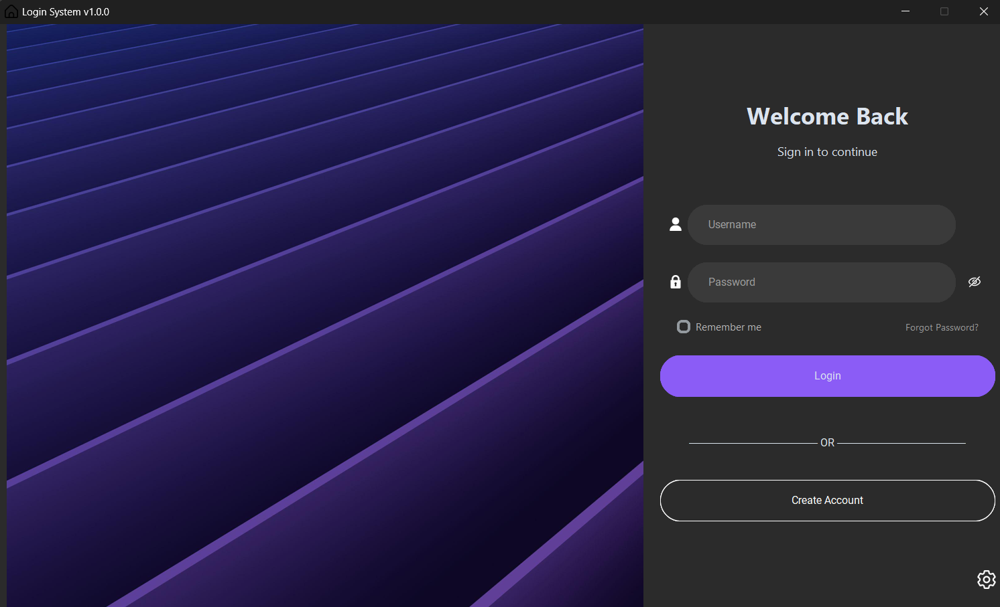
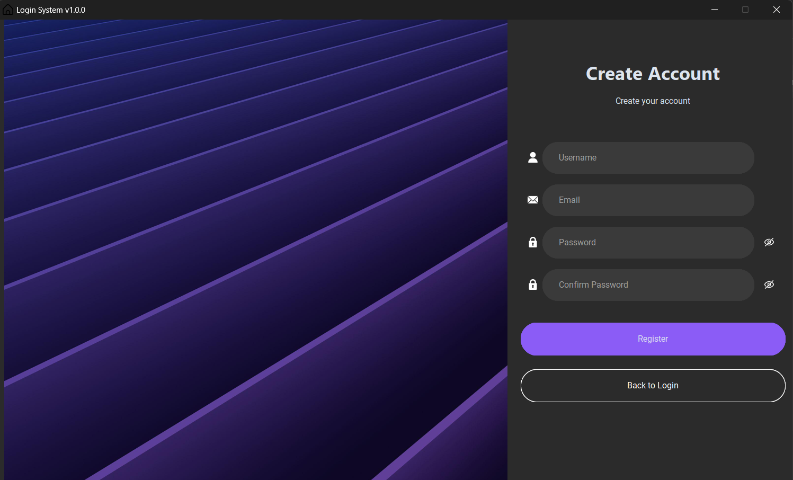
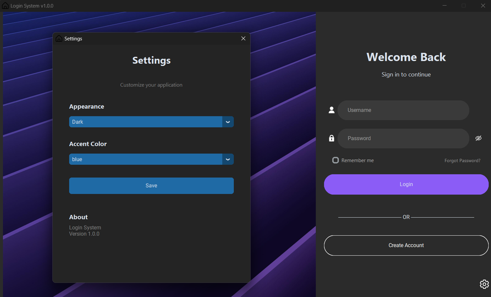
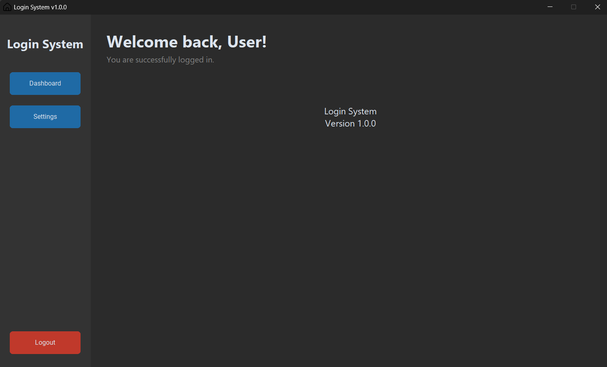

# Login System

A modern open-source login system built with Python and CustomTkinter. Features secure password hashing with bcrypt, SQLite database integration, session management, logging system, and dynamic theme support. Designed with a modular architecture for easy customization and real-world use.

## Features

* Modern UI
* Dark and Light mode
* Dynamic icon system
* SQLite database
* Password encryption with bcrypt
* Remember Me
* Session management
* Settings window
* Logger system
* Password validators
* Forgot Password structure
* Modular architecture

---

## Technologies

* Python
* CustomTkinter
* SQLite
* bcrypt
* Pillow

---

## Project Structure

```text
app/
├── assets/
├── components/
├── config/
├── core/
├── database/
├── models/
├── services/
├── utils/
└── views/
```

---

## Installation

```bash
git clone https://github.com/MaiconDuarte1/login-system.git

cd login-system

pip install -r requirements.txt

python main.py
```

---

## Screenshots

### Login



### Register



### Settings



### Dashboard



---

## License

This project is available for educational purposes.
